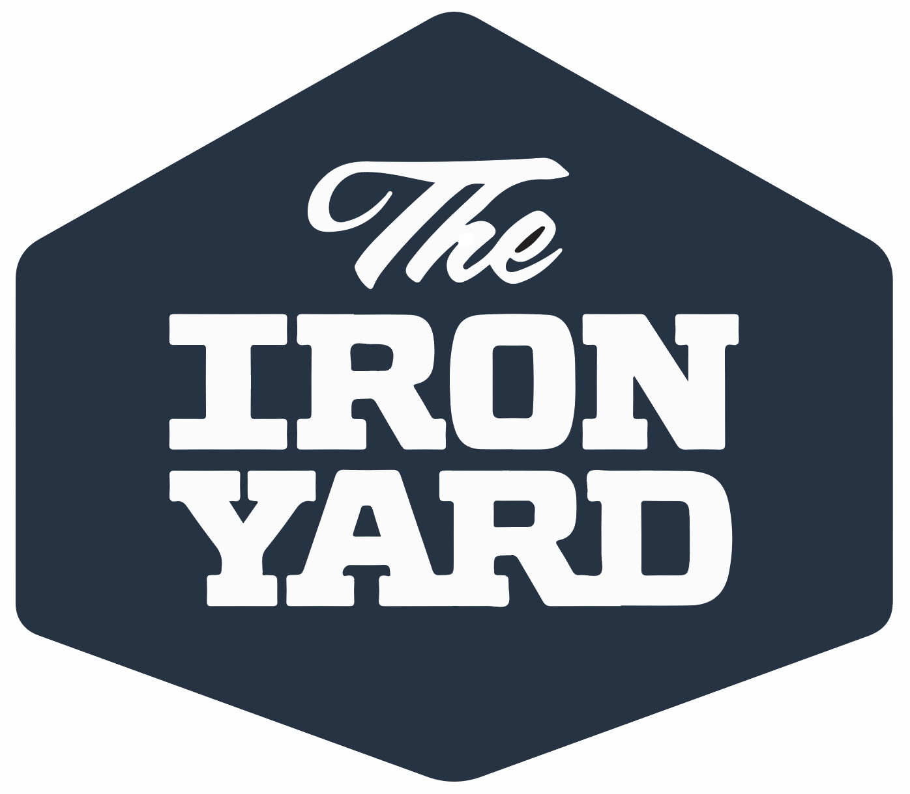

<!--  -->

<!-- **johnsonr84/johnsonr84** is a ✨ _special_ ✨ repository because its `README.md` (this file) appears on your GitHub profile. -->

Hello Code Ninjas!  [] I'm Rob
======================================================================================================================================

Full Stack Software Developer
------------------------------------------

* 🌍  I'm based in Colorado 
* ✉️  You can contact me at [devdork@gmail.com](mailto:devdork@gmail.com)
* 🚀  I'm currently working on [Developing Platforms](http://comingsoon.com)
* 🧠  I'm learning Angular & Ruby
* ⚡  Software Development by day Code Camp Teaching Assistant by night

### Skills 💻

### Socials 📲

  

### My GitHub Stats 📈

### Support Me

## Certifications 🏆

 <table>
  <tr>
    <td>Full Stack Engineering</td>
    <td>Front End Engineering</td>
  </tr>
    <tr>
    <td></td>
    <td></td>
  </tr>
 </table>

<!-- # Hello My Fellow Code Ninjas! 

### I'm a Full Stack Developer, Dog Father, Drummer, Skater & Martial Artist

  

I am currently rebuilding [Devdork](https://www.devdork.com/) in react 💻

<!-- Github Stats -->

<!--   
   -->

<!-- Social Links & Contact -->

<!-- ## Contact Me 📲 -->

<!-- 

  -->

<!-- ## Tech Toolbox 🛠 -->

<!-- 

 -->

<!-- ## Certifications 🏆

 <table>
  <tr>
    <td>Full Stack Engineering</td>
    <td>Front End Engineering</td>
  </tr>
    <tr>
    <td></td>
    <td></td>
  </tr>
 </table> --> 
